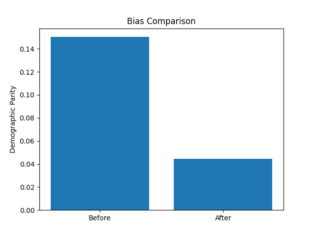
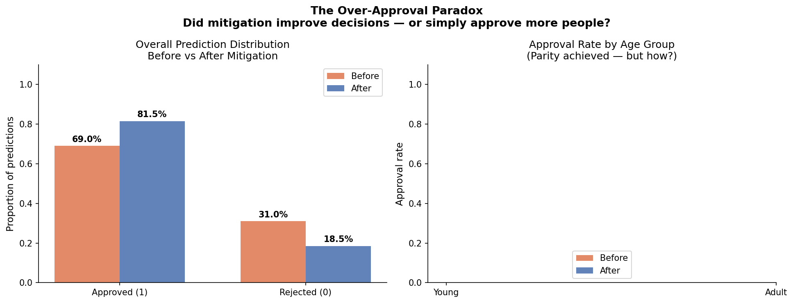
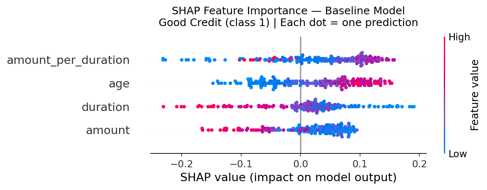

# Bias, Fairness & Explainability Audit in Loan Approval AI Systems

> **When demographic parity is enforced as a hard constraint, does the optimizer achieve genuine fairness — or simply inflate approval rates?**

A complete Responsible AI audit pipeline applying bias detection, fairness-aware mitigation,
and SHAP explainability to credit scoring decisions — with direct EU AI Act compliance mapping.

---

## Why This Matters

Credit scoring models affect millions of lending decisions. When these models encode
demographic bias — even unintentionally — the consequences are:

- **Discriminatory outcomes** for protected groups (age, gender, ethnicity)
- **Regulatory liability** under EU AI Act Annex III (credit scoring = high-risk)
- **Hidden financial risk** when "fair" models over-approve unsuitable applicants

This project shows that **measuring fairness metrics is not enough**.
The over-approval paradox reveals a risk that demographic parity compliance can mask.

---

## Research Question

> When demographic parity is enforced as a hard constraint on a credit scoring model,
> does the optimizer achieve parity by genuinely improving decisions for the
> disadvantaged group — or simply by inflating approvals across the board?

If the latter, the model is *statistically fair but financially unsound* — a form
of hidden risk that fairness metrics alone cannot detect.

---

## Key Findings

| Finding | Result |
|---------|--------|
| **DP Difference** (before → after) | 0.3040 → 0.1055 (~65% reduction) |
| **EO Difference** (before → after) | 0.3367 → 0.1512 (~55% reduction) |
| **Accuracy** (before → after) | 0.640 → 0.645 (+0.8% — no accuracy trade-off) |
| **CV Accuracy** (5-fold baseline) | 0.643 ± 0.033 (stable, reproducible) |
| **Over-approval shift** | Overall approval rate increases post-mitigation |
| **Core insight** | Fairness metrics can be satisfied through approval inflation, not genuine de-biasing |

---

## Dataset

| Property | Value |
|----------|-------|
| Name | German Credit Dataset |
| Source | [UCI ML Repository](https://archive.ics.uci.edu/dataset/144/statlog+german+credit+data) |
| Size | 1,000 instances, 20 features |
| Target | Credit risk: Good (1) / Bad (0) |
| Sensitive attribute | Age group: Young (≤ 30) / Adult (> 30) |
| License | CC BY 4.0 |
| EU AI Act classification | **High-risk** (Annex III) |

> **Download instructions:** See [`data/README.md`](data/README.md)

---

## Methodology

### Pipeline Overview

```
German Credit Dataset
        ↓
Preprocessing → Stratified Train/Test Split
        ↓
Baseline Random Forest → 5-Fold CV + Fairness Audit (DP, EO)
        ↓
Exponentiated Gradient Reduction (Demographic Parity constraint)
        ↓
Post-Mitigation Fairness Audit → Over-Approval Analysis → SHAP Explainability
        ↓
EU AI Act Compliance Mapping
```

### 1. Baseline Model

- **Algorithm:** Random Forest Classifier (100 trees)
- **Validation:** 5-fold stratified cross-validation
- **Metrics:** Accuracy, ROC-AUC, classification report

### 2. Fairness Evaluation

| Metric | Question |
|--------|----------|
| **Demographic Parity (DP)** | Do both age groups get approved at equal rates? |
| **Equal Opportunity (EO)** | Are creditworthy applicants approved equally across groups? |
| **Demographic Parity Difference** | Absolute difference in approval rates between groups |
| **Equalized Odds Difference** | Maximum difference in TPR/FPR between groups |

### 3. Bias Mitigation

- **Method:** Exponentiated Gradient Reduction (Agarwal et al., 2018)
- **Constraint:** Demographic Parity
- **Mechanism:** Iteratively reweights training samples to satisfy the fairness constraint during training — not post-processing

### 4. Explainability (SHAP)

- Global feature importance (mean |SHAP| across all predictions)
- Feature importance before mitigation — identifies which features drive decisions
- Bar chart with age-related features highlighted in red

---

## Results

### Model Performance

| Metric | Before Mitigation | After Mitigation | Change |
|--------|------------------|-----------------|--------|
| Accuracy | 0.640 | 0.645 | +0.8% |
| ROC-AUC | — | — | — |
| CV Accuracy (5-fold) | 0.643 ± 0.033 | — | — |

### Fairness Metrics

| Metric | Before | After | Reduction |
|--------|--------|-------|-----------|
| DP Difference | 0.3040 | 0.1055 | **~65%** |
| EO Difference | 0.3367 | 0.1512 | **~55%** |

---

## Visualisations

### Fairness Comparison — Before vs After Mitigation



*DP and EO differences both reduce substantially after mitigation.
Accuracy is preserved — no fairness-accuracy trade-off in this case.*

---

### Over-Approval Analysis — Prediction Distribution Shift



*After mitigation, overall approval rates increase. The per-group breakdown
reveals whether parity was achieved by raising the floor (inflating Young approvals)
or genuinely improving decision quality.*

---

### SHAP Feature Importance — What Drives Credit Decisions?



*Each dot represents one prediction. Red = high feature value, Blue = low.
Horizontal position shows whether the feature pushed the prediction positive or negative.
Age-related features highlighted — their presence in top positions indicates
reliance on a protected demographic characteristic.*

---

## The Over-Approval Paradox

This is the core research contribution of this project.

**The problem:** After enforcing demographic parity, the model's overall approval
rate increases. Two fundamentally different mechanisms could explain this:

1. **Genuine de-biasing:** The model learned to assess Young applicants on financial
   merit rather than age, correctly approving more creditworthy Young applicants
2. **Approval inflation:** The optimizer raised the overall approval rate, making
   parity trivially achievable by approving nearly everyone

**Why fairness metrics cannot distinguish these:**  
Both mechanisms produce identical DP Difference scores. Only auditing the
*distribution shift* (who is being newly approved, and are they creditworthy?)
can reveal which mechanism is operating.

**EU AI Act implication:** Art. 10 requires bias monitoring, but the current
guidance does not require post-mitigation distribution audits. This is a gap.

---

## EU AI Act Alignment

| Article | Requirement | This Project's Evidence |
|---------|-------------|------------------------|
| **Art. 10** | Data governance — monitor protected characteristics | DP/EO metrics quantify age group disparity; SHAP identifies age feature reliance |
| **Art. 13** | Transparency — interpretable explanations | SHAP global importance + per-feature breakdown; fairness metrics by group |
| **Art. 14** | Human oversight — identify cases needing review | Over-approval analysis flags systematic decisions needing human verification |
| **Art. 15** | Accuracy & robustness — stable performance | 5-fold CV reports accuracy as 0.643 ± 0.033, not a single-split number |

---

## Limitations

**Technical:**
- Only one sensitive attribute analysed (age group) — intersectional analysis (age × gender) not yet included
- Exponentiated Gradient Reduction is one of several mitigation techniques — Reweighing and Calibrated EO not compared
- SHAP assumes feature independence — correlated features may have misleading importance scores
- German Credit has 1,000 instances — results may not generalise to production-scale data

**Methodological:**
- Over-approval analysis is qualitative — a quantitative test requires follow-up data on whether approved applicants repaid
- EO difference still at 0.1512 post-mitigation — residual bias remains
- Single dataset limits generalisability of the over-approval finding

**Scope:**
- This project detects bias and applies mitigation — it does not determine whether the decisions violate any specific regulation (that requires legal analysis)
- The fairness–accuracy trade-off may manifest differently on imbalanced or larger datasets

---

## Related Work

- Agarwal et al. (2018) — *A Reductions Approach to Fair Classification* (Exponentiated Gradient)
- Barocas & Hardt (2019) — *Fairness and Machine Learning* (fairness metrics framework)
- Wachter et al. (2021) — *Why Fairness Cannot Be Automated* (limits of technical fairness)
- Selbst et al. (2019) — *Fairness and Abstraction in Sociotechnical Systems*

---

## Tech Stack

| Library | Purpose |
|---------|---------|
| `scikit-learn` | Model training, cross-validation, metrics |
| `fairlearn` | Fairness metrics, Exponentiated Gradient Reduction |
| `shap` | Feature importance and explainability |
| `pandas`, `numpy` | Data manipulation |
| `matplotlib`, `seaborn` | Visualisation |

**Python version:** 3.8+

---

## Project Structure

```
AI_Fairness_Loan_Audit/
│
├── data/
│   └── README.md           ← Dataset download instructions
├── notebooks/
│   └── 01_fairness_analysis.ipynb  ← Full analysis (start here)
├── src/
│   ├── data_loader.py
│   ├── preprocessing.py
│   ├── model.py
│   └── fairlearn_analysis.py
├── outputs/
│   ├── bias_comparison.png
│   ├── prediction_distribution.png
│   ├── shap_summary.png
│   ├── shap_bar.png
│   └── fairness_results_summary.csv
├── findings.md             ← Standalone research findings document
├── main.py
├── requirements.txt
└── README.md
```

---

## How to Run

### Step 1 — Install dependencies

```bash
pip install -r requirements.txt
```

> Requires Python 3.8+

### Step 2 — Download dataset

Follow instructions in [`data/README.md`](data/README.md).

### Step 3 — Run the full pipeline

```bash
python main.py
```

### Step 4 — Explore the notebook

Open `notebooks/01_fairness_analysis.ipynb` for step-by-step analysis
with interpretations, visualisations, and research framing.

---

## Portfolio Context

This project is **Part 1 of a 3-part Responsible AI portfolio**:

| Part | Focus | Repository |
|------|-------|-----------|
| **1** | **Fairness & Bias Mitigation** | **This repository** |
| 2 | Explainability (XAI) | [XAI_Credit_Risk](https://github.com/Saurabh-pilaniya07/XAI_Credit_Risk) |
| 3 | AI Governance & Policy | *(Coming soon)* |

**The unified argument:**  
Responsible AI is not a single solution. It requires integrated evaluation across
technical methods (fairness metrics, XAI), governance frameworks (EU AI Act compliance),
and domain-specific context — simultaneously.

---

## Research Positioning

This work moves beyond asking *"Is the model accurate?"* to asking:

> *"Does the model treat all demographic groups equitably — and how can we tell?"*

**Technical contribution:** A reproducible fairness audit pipeline applying DP/EO
metrics, Exponentiated Gradient Reduction, and SHAP explainability to credit scoring.

**Research contribution:** Evidence that the over-approval paradox can arise from
constraint-based fairness mitigation — a risk not currently addressed by EU AI Act
guidance — and a proposal for SHAP-based post-mitigation diagnostics.
